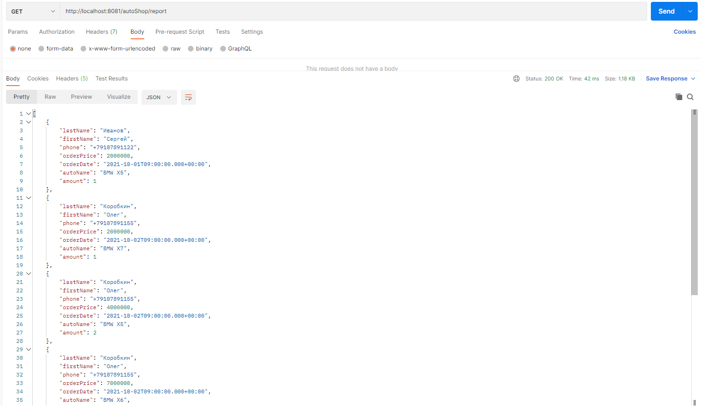

# Before getting a job

Данный проект представляет собой реализацию тестового технического задания.  
Реализованный функционал:
* посмотреть выручку за период;
* просмотреть упорядоченный массив заказов.

## Стек технологий
* Java 17
* PostgreSQL 14
* Apache Maven 3.8.5
* Spring Boot 2.7.5
* Liquibase 3.6.2
* Lombok 1.18.24
* JUnit 5.8.2
* Mockito 4.5.1
* Checkstyle 8.29

## Требуемое окружение для запуска проекта
* Postman
* JDK 17
* Apache Maven 3.8
* PostgreSQL 14

## Инструкция по запуску проекта
1) Скачать и разархивировать проект
2) В PostgreSQL создать базу данных cinema (url = `jdbc:postgresql://127.0.0.1:5432/auto_shop`)
3) Открыть командную строку и перейти в папку с проектом, например `cd c:\projects\auto_shop`
4) Выполнить команду `mvn install`
5) Перейти в папку target командой `cd target`
6) Выполнить команду `java -jar before-getting-job-1.0.jar`

## Взаимодействие с приложением

### Выводим выручку за нужный период

### Выводим упорядоченный массив заказов
